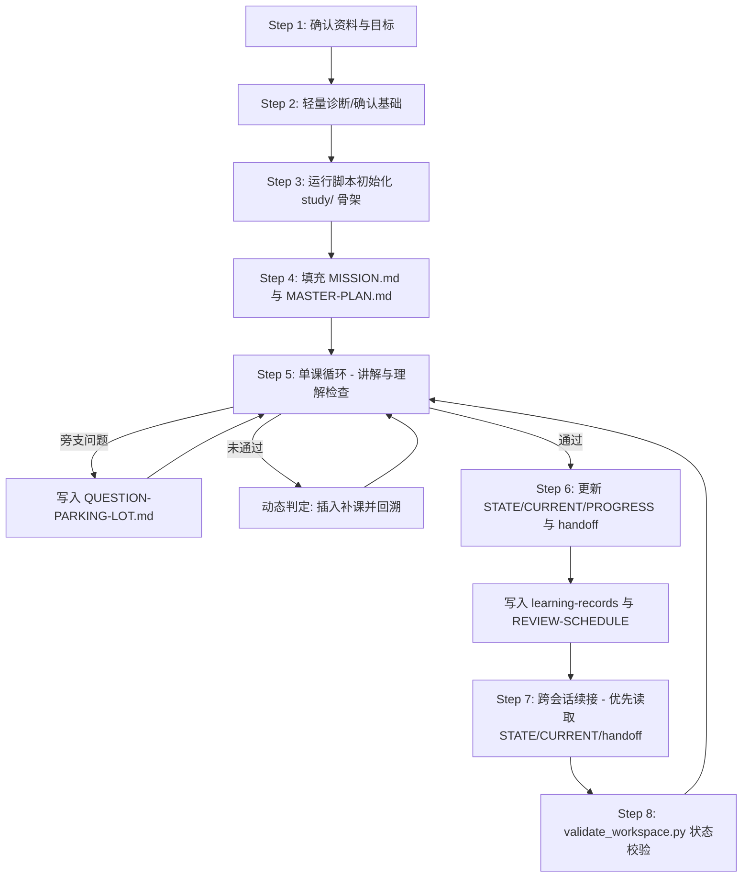

# Study System - AI 伴学系统自定义 Skill

`study-system` 是一个专为 AI Agent（如 Claude Code、Claude、Gemini 等）设计的**持续伴学系统 Skill**。它将传统的“一问一答式教学”转变为“持续推进的学习工作区运营”，帮助用户在 AI 的协助下，系统化、有步骤、有反馈地吃透任何一个复杂的知识领域或项目。

---

## 🚀 解决的痛点

在传统的 AI 教学/伴学场景中，通常存在以下三个痛点：

1. **缺乏主线**：走到哪讲到哪，学习进度容易失控或跑偏。
2. **没有验收标准**：AI 讲完了不等于用户学会了。缺乏有效的主动理解检查。
3. **跨会话上下文丢失**：新开一个 Chat 窗口，之前学到哪里、掌握到什么程度全部丢失，需要重新对齐。

`study-system` 通过在用户项目根目录下构建一个**持久化、可追踪的学习工作区 (`study/` 目录)**，让 AI 能够像教练一样，跨会话地追踪用户的学习进度、进行理解检查，并动态插入补课计划。

---

## 🧠 核心设计原则

1. **先建体系，再上课程**：不盲目开讲。在正式开始学习前，必须先理清学习目标（Mission）、主计划（Master Plan）和起点，搭建结构化的骨架。
2. **主线固定，动态补课**：学习主线保持清晰，允许因基础薄弱随时插入“补课”或“概念复习”，但补课必须有明确的目的和边界，且结束后必须回到主线。
3. **按掌握程度推进，不按时间推进**：摒弃机械的“X天计划”，只有在用户通过“理解检查”后，才能进入下一课。
4. **“讲过”不等于“学会了”**：严格区分 **Exposure (接触过)** 和 **Understanding (理解了)**。只有用户能用自己的话解释或通过场景题测试，才能将知识记录在学习档案中。
5. **状态一致**：`STATE.json`、`CURRENT.md`、`PROGRESS.md`、`COURSE-LIST.md` 和最新 handoff 必须使用同一套状态模型，避免长期学习过程中状态漂移。
6. **问题不等于补课**：不阻塞主线的问题进入 `QUESTION-PARKING-LOT.md`，避免每个旁支问题都打断课程。
7. **通过不等于长期掌握**：通过理解检查后，还要进入 `REVIEW-SCHEDULE.md` 做后续复习与迁移验证。

---

## 📂 项目目录结构

本仓库是一个完整的 Custom Skill 资源包，目录结构如下：

```text
study-system/
├── SKILL.md                    # 核心 Skill 定义文件，包含 Agent 的触发规则、原则及工作流指令
├── README.md                   # 本说明文件
├── scripts/
│   ├── init_workspace.py       # 初始化 study/ 学习工作区
│   └── validate_workspace.py   # 校验 study/ 工作区状态一致性
├── references/                 # 指导 Agent 执行伴学动作的参考规范
│   ├── diagnostic-questions.md # 5个核心领域的轻量诊断问题模板
│   ├── lesson-flow.md          # 单课教学流程设计及“理解检查”方法论
│   ├── dynamic-makeup-rules.md # 动态补课的触发判定与规则表
│   ├── handoff-protocol.md     # 跨会话续接时的文件读取与交接规范
│   └── status-model.md         # STATE/CURRENT/PROGRESS/COURSE-LIST/handoff 的统一状态模型
└── templates/                  # 工作区各类文档的模板文件（供初始化脚本调用）
    ├── MASTER-PLAN.md.template
    ├── MISSION.md.template
    ├── CURRENT.md.template
    ├── PROGRESS.md.template
    ├── QUESTION-PARKING-LOT.md.template
    ├── REVIEW-SCHEDULE.md.template
    └── ...
```

---

## 🛠️ 安装方式

### 方式一：Claude Code 全局安装

适合希望在所有项目里都能调用这个 Skill 的场景。

```bash
mkdir -p ~/.claude/skills
git clone https://github.com/twj515895394/study-system-skill \
  ~/.claude/skills/study-system
```

### 方式二：Claude Code 项目级安装

适合只想在当前项目中使用这个 Skill 的场景。

```bash
mkdir -p .claude/skills
git clone https://github.com/twj515895394/study-system-skill \
  .claude/skills/study-system
```

### 触发方式

安装后，可以直接对 Agent 说：

- “帮我系统学习这个仓库”
- “为这个项目建立 study 学习工作区”
- “我要读懂这个项目/课程/资料”
- “继续上次的 study-system 学习”
- “陪我长期学 X”

---

## 🚦 初始化学习工作区

当触发 Skill 时，AI 会引导你进行轻量诊断，确认你的目标与资料情况，并在你的项目根目录下执行脚本来初始化工作区。

安装为 Claude Code Skill 后，推荐使用以下命令：

```bash
python "${CLAUDE_SKILL_DIR}/scripts/init_workspace.py" \
  --root ./study \
  --topic "RAG 系统原理" \
  --domain code
```

如果你是在本仓库根目录内本地开发，也可以直接执行：

```bash
python scripts/init_workspace.py --root ./study --topic "RAG 系统原理" --domain code
```

初始化会生成：

- `STATE.json`：机器可读状态摘要。
- `MISSION.md` / `MASTER-PLAN.md` / `CURRENT.md` / `PROGRESS.md` 等核心看板。
- `QUESTION-PARKING-LOT.md`：问题停车场，用于控制发散。
- `REVIEW-SCHEDULE.md`：复习计划，用于跟踪长期掌握。
- `study/_templates/`：工作区内置课程、handoff、learning-record 模板。

### 参数说明

- `--root`: 工作区根目录，默认 `./study`。
- `--topic`: 学习主题名称。
- `--domain`: 学习领域，决定生成的资料地图文件名。
  - `code` -> `SOURCE-READING-MAP.md` (源码阅读地图)
  - `course` -> `TEXTBOOK-READING-MAP.md` (教材阅读地图)
  - `industry` -> `RESOURCE-READING-MAP.md` (资料阅读地图)
  - `exam` -> `EXAM-ROADMAP.md` (考试路线图)
  - `child` -> `SCHOOL-SYNC-PLAN.md` (学校同步进度图)
  - 亦可传入其他自定义字符串，如 `research`。
- `--reading-map-name`: 自定义资料地图文件名（覆盖 domain 默认）。
- `--reading-map-title`: 自定义资料地图标题。
- `--diagnosis-mode`: 诊断模式说明。

---

## 🔄 标准工作流 (The 8-Step Workflow)



### 详细步骤说明

1. **确认资料与目标 (Step 1)**：AI 明确用户的资料来源（代码、教材、论文等）以及期望达到的终点状态。
2. **轻量诊断 (Step 2)**：AI 从 `references/diagnostic-questions.md` 选取 3-5 个针对性问题，摸清用户基础，制定合适坡度。
3. **搭建工作区 (Step 3)**：AI 调用脚本，在项目目录下生成 `study/` 目录、状态文件、核心看板、问题停车场、复习计划和工作区模板。
4. **填充主计划 (Step 4)**：AI 细化填充 `MASTER-PLAN.md`（课程清单与阶段验收标准）和 `MISSION.md`（定义阶段成功图景）。
5. **单课循环 (Step 5)**：采用“一课一主题”设计，课后进行严格的**理解检查 (Comprehension Check)**，杜绝“懂了吗”这种流于表面的提问；不阻塞主线的问题进入 `QUESTION-PARKING-LOT.md`。
6. **收尾与记录 (Step 6)**：只有通过检查，才能更新 `STATE.json`、`PROGRESS.md`、`CURRENT.md`、`learning-records/`、`GLOSSARY.md`、`REVIEW-SCHEDULE.md`，并在 `handoffs/` 下写交接单。
7. **跨会话续接 (Step 7)**：新对话开始时，AI 优先读取 `STATE.json`、`CURRENT.md` 和最新 `handoff` 快速热启动，直接对齐上节课的内容。
8. **状态校验 (Step 8)**：阶段收尾、新会话接手、或发现状态冲突时运行 `validate_workspace.py`，先修复一致性问题，再继续授课。

---

## 🧭 统一状态模型

`STATE.json`、`CURRENT.md`、`PROGRESS.md`、`COURSE-LIST.md` 和最新 handoff 统一使用以下状态：

```text
未开始 / 进行中 / 待理解检查 / 待补课 / 补课中 / 已完成 / 需复习 / 暂停
```

关键规则：

- `待理解检查`、`待补课`、`补课中` 不能直接进入下一节主线课。
- 只有状态为 `已完成`，才允许写入 `learning-records/` 和 `GLOSSARY.md`。
- 如果多个文件状态冲突，应先同步状态，再继续授课。

详细定义见 `references/status-model.md`。

---

## ✅ 工作区校验

```bash
python "${CLAUDE_SKILL_DIR}/scripts/validate_workspace.py" --root ./study
```

`validate_workspace.py` 只读不写，主要检查：

- 必需文件和目录是否存在。
- `STATE.json` 是否合法，`latest_handoff` 是否存在。
- 状态是否使用统一枚举。
- `PROGRESS.md` 与 `COURSE-LIST.md` 的同一课次状态是否一致。
- 未完成课程是否误填了 `learning-record`。
- handoff 文件名是否符合 `YYYY-MM-DD-Lxx-slug.md` 规范。

---

## 📈 贡献与定制

该系统模板可以根据你特定的教学理念或项目性质进行扩展：

- **扩充诊断问题**：修改 `references/diagnostic-questions.md` 添加全新的专业细分领域。
- **增加课程模板**：在 `templates/` 下定义更适合特定语言（如 Go/Rust）或特定类型考试的专有课表模板。
- **扩展状态校验**：基于 `scripts/validate_workspace.py` 增加更严格的 `STATE.json` / Markdown 一致性检查。

---

## 📄 License

本项目采用 [MIT License](LICENSE) 许可协议。
