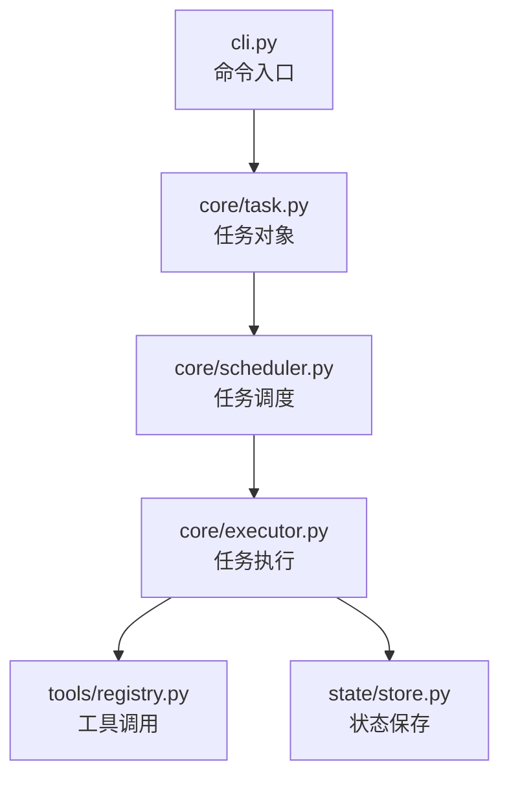
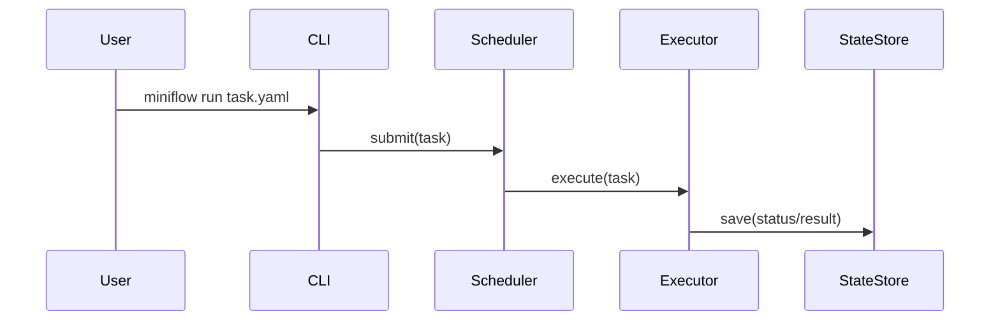

# 第 L01 课：系统总览与核心目录

## 本课类型

架构拆解课。

## 本课目标

建立 MiniAgentFlow 的整体项目地图，理解核心目录职责，并知道后续为什么要从 CLI 入口追到 scheduler。

## 本课在主计划中的位置

Phase 1 的第一课，用于建立后续源码调用链阅读的基础。

## 总览图

## 关键概念表

| 概念 | 一句话定义 | 常见误解 | 是否进入 GLOSSARY |
|---|---|---|---|
| Task | 一次待执行任务的数据对象 | 以为它等于执行逻辑 | 是 |
| Scheduler | 决定任务何时、以什么顺序进入执行 | 以为它直接做工具调用 | 是 |
| Executor | 负责实际执行任务并产生副作用 | 以为它负责排队策略 | 是 |
| State Store | 保存任务执行状态 | 以为它只是一份日志 | 是 |

## 核心流程图

## 资料/源码锚点

- `src/miniflow/cli.py`
- `src/miniflow/core/task.py`
- `src/miniflow/core/scheduler.py`
- `src/miniflow/core/executor.py`
- `src/miniflow/state/store.py`

## 现实场景类比

MiniAgentFlow 可以类比一个小型工单系统：CLI 是前台窗口，Task 是工单，Scheduler 是派单员，Executor 是执行人员，State Store 是工单记录系统。

类比边界：真实项目中的 executor 可能有异步、并发、工具权限等复杂机制，不能把它简单理解成人工执行。

## 常见误区

1. 把 Scheduler 和 Executor 混在一起。
2. 只看入口文件，不追数据对象如何流动。
3. 以为 State Store 只是日志，而不是后续恢复、调试和可观测性的基础。

## 小练习

请把 `cli/`、`core/`、`tools/`、`state/` 四层分别用一句话解释。

## 理解检查

检查方式：职责边界复述 + 主链路复述。

题目：不用看上文，说明 MiniAgentFlow 从用户输入命令到保存任务状态，经过哪些核心模块？每个模块负责什么？

## 理解检查评分

- 用户回答摘要：用户能说出 CLI 负责接收命令和参数，Task 承载任务数据，Scheduler 负责调度，Executor 负责执行，State Store 保存状态。
- 掌握等级：Understanding
- 是否通过：是
- 通过证据：用户能区分 Scheduler 和 Executor 的职责，并能说明为什么下一节要追 CLI -> Scheduler 的调用链。
- 仍存在的问题：对 Tool Registry 的作用还只是听过，未达到 Understanding。
- 后续处理：进入下一课；Tool Registry 暂不补课，后续 L06 专门讲。

## 反馈纠偏

纠正了“Scheduler 直接调用工具”的误解：Scheduler 只决定调度策略，具体执行和工具调用属于 Executor / Tool Registry 相关路径。

## 是否收尾

已收尾。理解检查达到 Understanding，可以进入 L02。

## 收尾文档更新

- `STATE.json`：current_status 更新为 `已完成`，latest_handoff 指向 L01 handoff。
- `CURRENT.md`：记录下一步进入 L02。
- `PROGRESS.md`：L01 标记为已完成。
- `reference/L01-system-overview.md`：已创建。
- `learning-records/system-overview.md`：已创建。
- `GLOSSARY.md`：写入 Task / Scheduler / Executor / State Store。
- `REVIEW-SCHEDULE.md`：加入系统总览能力点。
- `handoffs/2026-06-25-L01-system-overview.md`：已创建。
